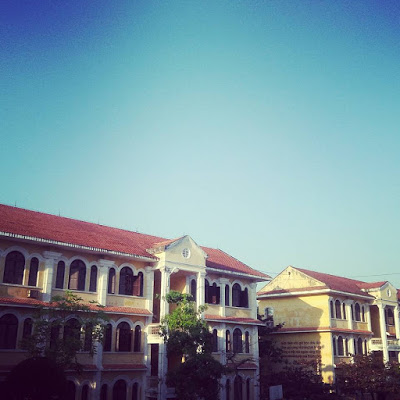
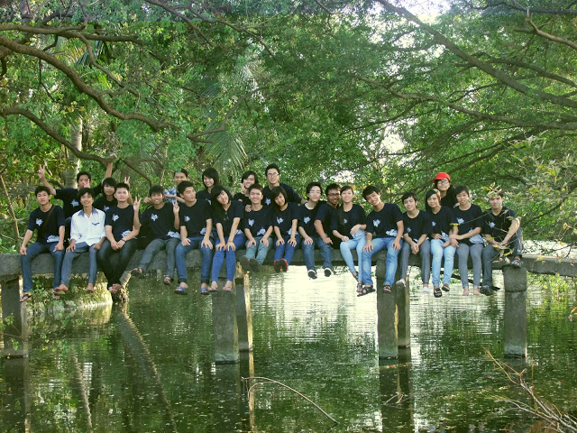

**10:28PM - 23/05/2020**  
**\[Phương Kể\] THPT chuyên Lê Hồng Phong Nam Định**

_"Khi ta ở chỉ là nơi đất ở_  
_Khi ta đi đất đã hóa tâm hồn."_

Học lực cấp 2 của tớ không tốt và tớ tự nhận thức được điều đó. Nhưng cuối năm lớp 9 tớ vẫn gửi hồ sơ thi vào hai trường chuyên, một là THPT chuyên của Đại học Quốc Gia Hà Nội (ĐHQGHN) và một là THPT chuyên Lê Hồng Phong Nam Định (LHPNĐ). Đương nhiên, thi cử chưa bao giờ là dễ dàng. Khi lên Hà Nội thi vào khối chuyên THPT của ĐHQGHN, tớ cũng không ôm nhiều hi vọng lắm vì có quá nhiều các bạn giỏi giang hơn cùng thi với tớ. Đợt đó thi vào khối chuyên Tin của ĐHQGHN thì không phải thi môn Tin mà chỉ Toán Văn thôi thì phải (lâu quá nên tớ cũng không nhớ nữa). Đương nhiên là đợt thi cấp 3 của trường ĐHQGHN là sớm nhất trong tất cả các trường cấp 3. Tham gia cuộc thi cấp cao nên tớ gặp nhiều bạn trùng tên kinh khủng. Lần đầu tiên thấy lắm người tên Mai Phương như vậy luôn. À, kết quả đương nhiên là tớ trượt, cũng không nhớ đợt đó được bao nhiêu điểm nữa. Nhưng mà tớ nhớ đề thì văn là về một người Tràng An, dựa vào câu "Chẳng thơm cũng thể hoa nhài / Dẫu không thanh lịch cũng người Tràng An". Nhớ cái đề thi vì lúc ấy chẳng biết người Tràng An là người ở đâu, lúc đó còn tưởng là người Ninh Bình vì tớ nhớ mọi người kêu là ở Ninh Bình có khu du lịch Tràng An - Bái Đính. Đi thi mà chả biết gì như tớ thì không trượt cũng lạ.

Kì thi đầu vào của LHPNĐ thì sau kì thì tuyển THPT chuyên của ĐHQGHN nhưng lại trước kì thi THPT bình thường. Điều ấn tượng nhất trong kì thi là thi môn chuyên thì phải thi giấy. Như các bạn thi môn chuyên khác thì là bình thường thôi nhưng tớ thi chuyên Tin. :D Thi lập trình, vẽ luồng thuật toán, các thứ các thứ khác đều trên giấy hết. Hình như còn bài tìm lỗi sai trong chương trình nữa. Nói chung là mọi thứ mà thầy dạy đội tuyển ngày đó truyền dạy cho thì được phát huy hết mức. Thứ làm tớ ấn tượng thứ hai là trong phòng thi toàn các bạn thi giải tỉnh được giải cao. :D Ngày đó tớ đi thi Tin cấp tỉnh có được giải đâu. Vô phòng thi các bạn cầm chứng nhận giải tỉnh các thứ ra làm mình run dễ sợ. Nhưng cũng là cái số khi đỗ được vào trường LHPNĐ. Thực ra quyết định lên tận Nam Định học cấp 3 cũng không hề dễ dàng với tớ. Nhưng ngày đó mà học ở trường THPT A Nghĩa Hưng thì tớ chỉ được vào lớp A4 thôi, nên tớ chuồn sớm. Gì chứ mà học lớp A1 của trường Năng Khiếu Nghĩa Hưng mà vô A4 thì lại bị làng xóm nói này nọ lắm. Nên hành trình xa nhà học hành của tớ bắt đầu từ những năm cấp 3, sớm hơn mọi người chút ít.

Ừm, nếu phải miêu tả ba năm cấp 3 của tớ bằng một cụm từ thì tớ sẽ nói "Không hối hận". Lớp 10, lớp tớ có 27 người nhưng chỉ có 4 bạn là có nhà ở TP Nam Định, còn lại thì hầu hết đều ở quê lên học. 27 người nhưng có tới tận 10 bạn nữ. Lớp chúng tớ trở thành lớp chuyên Tin kì lạ nhất trong ghi nhận của trường, ít nhất là cho tới lúc đó. Thật ra thì năm lớp 10 tớ vinh dự được ngồi cạnh bạn Top 1 đầu vào của lớp (thi giấy và bạn ấy được 10 điểm Tin ạ). Nhưng cũng không phải là vui vẻ gì lắm đâu. Vì tớ, một con bé đang tự thu mình lại trong vỏ bọc của bản thân, một cái vỏ bọc cũng không phải xinh đẹp nhỏ nhắn gì cho cam, lại gặp một bạn nam cùng bàn không được ga-lăng cho lắm. Sau này lớn hơn một chút, khi suy nghĩ đã cởi mở hơn, bạn nam ấy tự dưng quay ra xin lỗi tớ trước mặt mọi người trong một buổi họp lớp nho nhỏ. Kể cũng hơi muộn nhưng có còn hơn không mà. :D Có nhiều chuyện thực sự không vui những năm cấp 3, nhưng giờ nghĩ lại thì tớ vẫn thấy rất phấn khích và tự hào vì đã trở thành 1 thành viên trong lớp chuyên Tin LHPNĐ khóa 91. 

Nói là lớp chuyên Tin nhưng mà lớp tớ chỉ có tầm 1/4 là tiếp tục học chuyên, còn lại thì chỉ tập trung học các môn liên quan tới thi đại học thôi. Nên tớ, một thành phần học không hề giỏi mà cũng chẳng chăm đã quyết tâm lao đầu vào học Tin tới cuối cùng. Thực ra vào LHP tớ mới biết là cách học Tin năm cấp 2 của chúng tớ nó hơi "sida" một tẹo. Nhưng cần cù thì bù thông minh, tớ "may mắn" được vào đội đi thi học sinh giỏi khu vực Duyên hải và đồng bằng Bắc Bộ. Sau đó lại "may mắn" được giải nhì. Một câu chuyện cười bên lề là lúc đi thi tớ không nhớ công thức tính tổng n số tự nhiên liền nhau luôn nên phải dùng vòng lặp For. Lúc thi xong về khóc sướt mướt vì tự nhận thấy sự dốt nát của bản thân. Tóm lại thì đợt thi đó tớ bơi trong sự may mắn để được giải. 

Nhưng may mắn không thể nuôi sống tớ mãi được. Sau đó là một chuỗi thất bại của tớ. Từ việc trượt vòng thi chọn đội tuyển thi Quốc Gia năm lớp 11 rồi năm lớp 12. Những năm đó chỉ cần có giải ở cuộc thi chuyên Quốc Gia thì sẽ được tuyển thẳng vào đại học nên tớ đã nuôi rất nhiều hi vọng. Đương nhiên là cuối cùng đành ôm nỗi buồn và sự thất vọng về bản thân đi về thôi. Theo đuổi chuyên Tin đã khó, từ bỏ để quay trở lại ôn thi đại học còn khó hơn. Như những dòng đầu tiên tớ viết thì tớ học không hề giỏi. Nên câu chuyện khi lên đại học chắc có lẽ còn buồn cười hơn cơ. :D Tớ sẽ kể tiếp sau nhá. 

