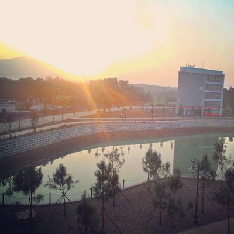
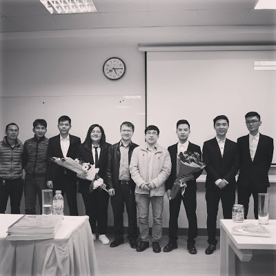

**08:27PM - 08/07/2020**  
**\[Phương Kể\] Đại học FPT**

Tớ biết đến đại học FPT trước kì thi tuyển vào trường tầm 2 hay 3 tháng gì đó nhờ vào lời giới thiệu của một người bạn xinh đẹp và dễ thương học cùng lớp. Cho ai đó không biết thì ngày đó có 2 cách để lấy học bổng của FPT. Một là học bổng Nguyễn Văn Đạo, thường dành cho những bạn thi quốc gia có giải nếu tớ nhớ không nhầm. Và đương nhiên là tớ không có suất đó nên tớ chọn cách thứ hai đó là tham gia thi tuyển để lấy học bổng tài năng. Bổ sung thêm một chút là kì thi vào FPT có khá nhiều đợt và có một kì thi tuyển vào tháng 5, trước khi kì thi vào các đại học khác diễn ra. Đề thi của FPT thì cũng chả liên quan gì tới kiến thức của bộ giáo dục (tớ nghĩ thế). Chúng tớ chỉ cần thi hai môn đó là Toán Logic và Nghị luận xã hội. Sau khi nộp hồ sơ dự thi thì bên FPT gửi về cho chúng tớ hẳn một quyển tuyển tập Toán Logic để ôn luyện trước khi thi luôn. Nên sau khi ôn bảy bảy bốn mươi chín đề Toán Logic trước kì thi thì hôm đi thi tớ vượt qua khá là suôn sẻ. Đề văn nghị luận thì cũng chỉ xoay quanh những vấn đề khá là quen thuộc, năm của tớ đề là: Suy nghĩ của em về "Lời nói chẳng mất tiền mua, lựa lời mà nói cho vừa lòng nhau". Nói chung là tớ đã hoàn thành cuộc thi một cách khá là tốt với kết quả cuối cùng là 95/105 điểm. Sau đó thì tớ phải tham gia một buổi phỏng vấn để xin học bổng. Lần này thì may mắn cũng không mỉm cười với tớ nữa, học bổng tớ nhận được là Học Bổng Tài Năng mức 50%. Đây không phải là kết quả tớ mong chờ nên sau đó tớ vẫn quyết định tham gia kì thi đại học như bình thường. Nhưng có lẽ cũng là một phần của số phận, sau tất cả tớ vẫn đặt chân vào FPT - nơi thay đổi con người tớ rất nhiều.

Đại học FPT đã cho tớ thật sự rất nhiều. Bốn năm học tập và tớ chỉ ở đúng một phòng KTX và ở đúng một vị trí giường ngủ. D301 - Nơi gặp gỡ của tớ và những con người tuyệt vời. Tớ đã từng suy nghĩ rất nhiều về Hoa Hoa và thường tự nhủ: Nếu biết yêu Hoa như vậy thì tớ sẽ dính chặt lấy Hoa từ những giây phút đầu tiên :). Và đương nhiên, tớ cũng nên học tập sự dịu dàng của Thúy rất nhiều vì chỉ cần được một phần như Thúy thôi thì mẹ tớ đã rất mừng rồi. Rồi còn cả chị Hoài và mấy đứa em khóa dưới nữa. Nếu nói điều quan trọng nhất của những năm đại học là gì thì tớ sẽ khẳng định với mọi người rằng, đó chính là bạn cùng phòng. 

Năm đầu đại học cũng là lần đầu tiên tớ biết tới cuộc thi ACM-ICPC và được chị em cùng phòng dẫn dắt đi thi. Kết quả đương nhiên là tớ kéo chân sau của team rồi. Sau đó thì không có sau đó nữa. Tớ không tham gia cuộc thi thêm một lần nào nữa. Có khá nhiều lí do nhưng có lẽ tớ thấy bản thân không đủ khả năng mới là lí do chính xác nhất. Thay vào đó tớ bắt đầu tích cực tham gia các câu lạc bộ và dành cho bản thân nhiều giây phút thư giãn hơn. Điều khiến tớ không bao giờ hối hận khi bước vào đại học FPT đó là môi trường học tập và sinh hoạt. Tớ, từ một đứa khá là trầm tính và tự ti đã trở thành một đứa năng động hơn, tự tin hơn. Tới chính bạn cấp 3 của tớ khi gặp lại cũng nhận xét tớ đã thay đổi rất nhiều kể từ khi vào đại học. Vì thế thanh xuân ở FPT là thứ tớ không phải hối tiếc.

Ra trường sau khi bảo vệ thành công đồ án, tớ bước chân vào tháng ngày đi làm rất là "vất vả" và "mệt nhọc" tại Gameloft. Cuối cùng tớ cũng đã kết thúc tháng ngày học hành rồi. :) Thật không?

