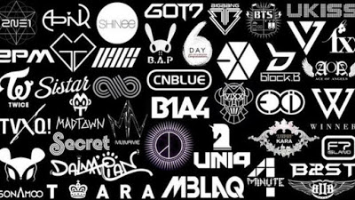
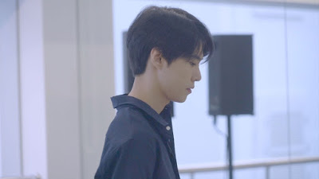

**04:28PM - 31/05/2020**  
**\[Something Old\] Thích Nhạc Hàn Thì Thế Nào?**

**14/12/2014**

Có một sự thật là từ khi lên đại học mình đã kìm hãm cái niềm yêu thích nhạc Hàn lại rất nhiều. Tới lớp mà mình nghe nhạc Hàn là lại có mấy đứa kêu cuồng Kpop. Tự dưng lại muốn giấu đi nhiều hơn. Nhưng giấu đi một ít rồi mà phần còn lại vẫn đủ để mọi người phán mình cuồng Kpop. :v Nhưng sự thật là mình đâu có cuồng??? Thích một nhóm nhạc Hàn quốc mà bị cho là cuồng Kpop thì nói thật người nói thế cũng hơi dở hơi thật. 

Hơn nữa cái nhóm mình thích, mình thấy rất đáng để thích mà :D. Đẹp trai (gái ai chả thích đẹp trai???), hát hay (cái này nhiều người vẫn thích kìa), nhảy đẹp (ừ thì cũng vài đứa trong nhóm nhảy đẹp nhưng cũng có thể cho là thế). Nghĩ lại cũng hơi hơi tự hào vì cái nhóm mình thích. Hơn nữa bọn nó còn hát cả tiếng nhật, mình thì nghe tiếng nhật của bọn nó nhiều, thế thì phải nói mình cuồng Jpop chứ nhỉ. :D 

Nói chúng là đi vào vấn đề, cứ cho là mình cuồng Kpop đi, chẳng thế nào cả. Mình không hành động dại dột, không làm gì quá đáng, tổn hại tới ai nên chẳng thể trách một đứa Kpop như mình. :v Cái nhóm nhạc mình thích nó còn đi với mình lâu hơn cả mấy đứa bạn đại học, từ thời cấp 3 cơ mà :D, nên chẳng có gì phải e ngại khoe ra một đứa "bạn thân" cả. 

Đôi khi cũng vì mấy thứ những người xung quanh nói mà thu liễm lại. Giờ thì ít nghe đi rồi đấy, chủ yếu nghe toàn US-UK thôi, cơ mà đôi khi buồn thì thích nghe nhạc của bọn nó hơn. Có gì đấy gần gũi hơn với mình mà. Còn hôm nay thì đọc được một cái Note của bà chị đi concert về, mình phát cuồng luôn. A~ Phải đổi ava với ảnh bìa cho thỏa nỗi lòng nữa.

 Quẩy lên~~

P/S: Không phải ai thích nhạc hàn cũng là cuồng Kpop. Chấm hết câu.

* * *

**31/05/2020**

Cũng đã 6 năm từ khi tớ viết những dòng trên. Bây giờ tớ vẫn là một người thích nghe nhạc Hàn. Nhìn từ góc nhìn của một người đã trưởng thành hơn và cũng đã trải nghiệm nhiều loại nhạc hơn thì đánh giá chung chung nhất của tớ về nhạc Hàn là: Catchy. Tớ vẫn nghe nhạc Hàn nhưng không nhiều như ngày trước nhưng có rất nhiều bài hot của KPOP tớ đều có thể thuộc giai điệu và ngân nga theo, chỉ vì mọi người xung quanh bật nghe 2 - 3 lần là nó thấm vào đầu tớ luôn. Thật sự, thật sự Catchy luôn ấy. :D 

Nếu nói về Hàn Quốc thì phải khẳng định đây là một cường quốc về công nghiệp giải trí. Không ai có thể phủ định điều đó. Và các IDOL - thần tượng thì được đào tạo thật sự kĩ càng trước khi được phép ra mắt. Nhưng một mặt tối mà ai ai cũng sẽ nhận ra đó là những người chọn con đường làm thần tượng đều phải sống trong một căn phòng được xây sẵn. Họ không được phép làm gì đó vượt quá những bức tường xây sẵn đó vì có hàng trăm, hàng triệu đứa trẻ nhìn và học theo họ. Áp lực cao, tập luyện căng thẳng và n thứ khác đều đè nén trên đôi vai của những thần tượng đó. Đừng đành giá người khác khi bạn không hề biết những gì họ phải chịu đựng phía sau. Thần tượng thực ra cũng là một nghề, và cái nghề đó không hề dễ dàng hơn những cái nghề mà bạn đang làm. Vì vậy, hãy tôn trọng họ.

Sasaeng fan - fan cuồng. Không chỉ xã hội sợ hãi những người này mà chính các thần tượng cũng sợ họ. Vẫn là hâm mộ, yêu thích nhưng cách fan cuồng thể hiện ra bên ngoài thật sự quá mức nhận thức của người thường. Và các thần tượng cũng là những người bình thường thôi mà. Nếu bạn nhận được những tin nhắn khủng bổ hàng ngày, những cuộc gọi, nháy máy mỗi đêm, hay cả những món quà bên ngoài là giấy bọc xinh xắn nhưng bên trong là con dao dính máu hay là một nắm tóc thì bạn có cảm giác vui vẻ không? Bạn đi làm 8 tiếng mỗi ngày, 16 tiếng còn lại là thời gian riêng của bạn. Thần tượng phải làm cả ngày, có hôm chỉ ngủ 2 3 tiếng nhưng cũng có khi không hề được ngủ nghỉ. Thế thì tại sao lại đưa những thái độ tiêu cực tới từ fan cuồng vào việc đánh giá các thần tượng? Hãy công bằng khi đánh giá họ.

Với cá nhân tớ, 6 năm rồi nhưng tớ vẫn giữ tinh thần cũ: thích ngắm trai đẹp và nghe nhạc hay. Vì vậy thích nghe hay xem Kpop vẫn là một trong những sở thích không hề gián đoạn của tớ. Và tớ vẫn vậy, chẳng hề che dấu. Đó không phải là cái gì đó xấu, đó chỉ là sở thích của tớ. Thế thì tại sao tớ phải trốn tránh hay che dấu? Là chính mình thì không bao giờ sai nhưng hãy nhớ đừng để sở thích của bản thân ảnh hưởng tiêu cực tới người khác. :)

* * *

_Bonus chiếc ảnh của thần tượng tớ đang thích hiện tại._

