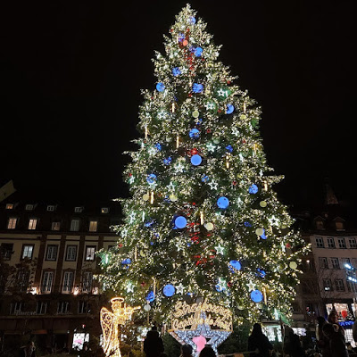
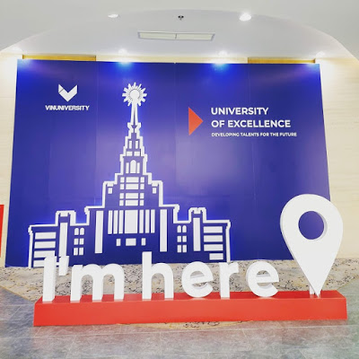
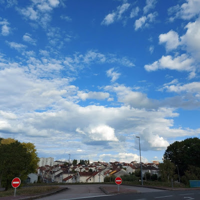

 **01:55PM - 25/12/2020  
\[Phương Kể\] University of Limoges**

_Bài viết này vẫn sẽ viết về tớ, một đứa nhiều cảm xúc và hay nói linh tinh :)_

Đã hơn 100 ngày tớ rời xa Việt Nam, rời xa bầu trời tớ đã sinh ra và lớn lên hơn 20 năm. Limoges những ngày này vẫn chỉ lạnh như bao năm trước nhưng với người mới đặt chân tới Pháp như tớ thì lại là lạnh thấm da thấm thịt. Sự háo hức chờ đợi tuyết rơi như những bộ phim ngày bé thường xem tràn ngập trong căn phòng nhỏ của tớ ở Limoges. Giáng sinh năm nay tớ đang ở một đất nước xa lạ.

Cuối tháng 2 năm 2020, vào một ngày dậy sớm tớ đã nói chuyện với Hoa Hoa và được động viên để đăng kí Master’s CRYPTIS Scholarship Program. Sáng hôm ấy có lẽ là ngày định mệnh và Hoa Hoa chính là quý nhân của tớ. Mọi thứ cần thiết để đăng kí chương trình học bổng đã được tớ cố gắng hoàn thành trong vòng hơn một tuần và tớ đã nhấn nút nộp hồ sơ trong những ngày cuối cùng trước khi hết hạn. Rồi sau đó là những ngày tháng chờ đợi dài dằng dặc. Đại dịch Covid-19 đã làm cho mọi thứ kéo dài hơn dự định nhưng may mắn cuối cùng vẫn đã tới. Tớ đã vượt qua vòng hồ sơ và bước và vòng phỏng vấn. Như những câu chuyện trước kia tớ hay kể, tớ không hề có duyên với các cuộc phỏng vấn nên tớ đã hốt hoảng thật sự. Nhưng khi bắt đầu vòng phỏng vấn thứ nhất thì mọi thứ không hề căng thẳng như tớ lo sợ. Các anh chị trong The Vingroup Science and Technology Scholarship Team thật sự rất tuyệt. Cũng nhờ thế mà tớ đã lấy lại được chút tinh thần để bước vào vòng phỏng vấn chuyên môn cuối cùng. Mọi thứ không hề hoàn hảo nhưng tớ cảm giác thật sự nhẹ nhõm vì bản thân ít nhất đã thử theo đuổi ước mơ với tất cả cố gắng. À và kết quả là tớ không được chọn. :) Thật đấy, tớ trượt nhưng được xếp vào danh sách chờ. Tớ vẫn nhớ rất rõ cảm giác khi nhận được email thông báo kết quả. Có chút hụt hẫng vì trượt nhưng thật ra tớ cũng có chút nhẹ nhõm. Vì sao á? Vì tớ không lỡ xa mọi người trong team DML ở Gameloft. Khi ấy thật sự nói chia xa là điều thật sự khó khăn với tớ. Nhưng bởi vì bây giờ tớ đã ở Limoges nên đương nhiên kết quả đã thay đổi vào phút cuối. Một bạn nam giấu tên đã bỏ qua cơ hội và tớ được chọn vào vị trí trống. Lại một lần nữa, may mắn đã mỉm cười với tớ. Ừ, là may mắn nhưng tớ vẫn có quyền tự hào vì bản thân chứ nhỉ :)

Trước khi đặt chân tới Pháp, tớ được tham gia vào các khóa học tiếng Pháp và những buổi định hướng trước khi du học với tư cách là một Vingroup Scholar. Chúng tớ đã được tham quan VinFast, VinAI, VinBrain và cả VinUniversity. Giây phút được ngồi cùng các bạn trong buổi lễ ngày hôm ấy, tớ thật sự rất tự hào.

Thời gian xin visa cũng là một khoảng thời gian rất khó khăn. Các nước Châu Âu khủng hoảng với đại dịch Covid-19. Pháp cũng đóng cửa biên giới và tạm dừng cấp visa du lịch nhưng may sao vẫn ưu tiên cấp visa du học. Càng gần ngày nhập học tớ càng lo lắng. Nhưng cuối cùng mọi thứ cũng đã diễn ra như những gì tớ mong muốn. Sau đường bay Hà Nội - Hồ Chí Minh - Singapore - Paris, chúng tớ tiếp tục lên tàu để về trường và cuối cùng đặt chân tới Limoges trong sự chào đón của các thầy và các bạn. Bầu trời Limoges hôm ấy thật sự rất đẹp. 

Cuối cùng tớ đã bước sang trang mới trong hành trình trưởng thành của mình. Còn cậu thì sao? Hãy dũng cảm đứng lên và bắt lấy ước mơ của mình nhé.  Nếu tớ có thể thì cậu cũng có thể :)

* * *

Sẽ thật tuyệt nếu cậu tham gia cùng tớ ^^  
[https://scholarships.vinuni.edu.vn/master-cryptis-scholarship-program/](https://draft.blogger.com/u/1/blog/post/edit/2806561286681450492/1310545970823083671#)
